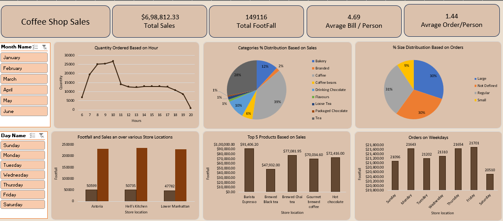

# ☕ Coffee Shop Sales Dashboard (Excel-Based)

This project showcases a detailed **sales dashboard** for a coffee shop, created entirely in **Microsoft Excel**. The dashboard provides visual insights into sales performance, customer behavior, and product popularity using interactive Excel charts and data tools.

## 📂 Project Description

The dashboard was developed using Excel's built-in charting and data visualization tools (like PivotTables, slicers, and charts). It provides a clean and insightful overview of:

- 📈 Sales trends
- 👣 Customer footfall
- 🔝 Best-selling products
- ⏰ Time-based order patterns
- 📍 Store-wise performance

---

## 📊 Key Highlights

- **Total Sales**: ₹6,98,812.33  
- **Total Footfall**: 149,116 visitors  
- **Average Bill per Person**: ₹4.69  
- **Average Orders per Person**: 1.44  

---

## 📈 Dashboard Components

- **📅 Month & Day Filters** (via slicers)
- **🕒 Quantity Ordered by Hour** – Line chart
- **📦 Sales Distribution by Category** – Pie chart
- **📏 Order Size Distribution** – Pie chart
- **📍 Store-wise Footfall & Sales** – Column chart
- **🥇 Top 5 Products by Sales** – Column chart
- **📅 Orders on Weekdays** – Bar chart

---

## 🧰 Tools Used

- **Microsoft Excel** – Main tool used for data visualization, analysis, and dashboard design.
- **Excel Features Used**:
  - PivotTables
  - PivotCharts
  - Slicers
  - Conditional formatting
  - Data aggregation formulas

---

## 📁 Files Included

- `Coffee_Shop_Sales_Dashboard.xlsx` – Excel file with interactive dashboard and data.
- `Coffee_Sales_Excel.png` – Preview image of the dashboard.

---

## 📷 Dashboard Preview

---

## 💡 Insights

- Peak order times are between **8 AM and 11 AM**.
- **Coffee** and **Tea** are the most popular product categories.
- **Barista Espresso** is the top-selling product.
- Weekdays (Monday to Friday) have higher order volumes compared to weekends.
- **Lower Manhattan** and **Hell’s Kitchen** locations show the highest footfall and sales.

---

## 📝 Author

**Samiksha Suryawanshi**  

